# Atlas System Architecture Map
> Generated: 2026-05-26 01:50 UTC | Modules: 42 | Go Files: 567 | Total LOC: 133,111

## Module Inventory

| Module | Go Files | Test Files | LOC | Role |
| --- | --- | --- | --- | --- |
| adversarial | 1 | 1 | 1,123 | 對抗性訓練（AdversarialTrainer、BattleResult、StressTest） |
| apigateway | 10 | 0 | 2,742 | _(no description)_ |
| autobacktest | 5 | 4 | 1,208 | _(no description)_ |
| backtest | 1 | 1 | 218 | 視窗回測（Window.Run） |
| baseline | 3 | 2 | 1,479 | Baseline policy 升降級與版本控制 |
| bootstrap | 4 | 1 | 717 | 系統初始化與儀表板路由註冊 |
| config | 8 | 4 | 8,311 | 環境變數讀取（ATLAS_* 前綴）、參數配置 |
| db | 1 | 1 | 74 | PostgreSQL 連接管理 |
| domain | 16 | 8 | 2,179 | 領域型別（`Regime`、`Recommendation`、`Position` 等字串 enum） |
| eventbus | 2 | 2 | 1,238 | 事件匯流排（ChannelEventBus、Publish/Subscribe） |
| eventlogic | 2 | 1 | 610 | _(no description)_ |
| evolution | 1 | 1 | 431 | 突變提案建構（BuildMutationBrief）、最弱代理選擇 |
| experiment | 8 | 12 | 3,808 | 實驗執行（`Executor`）與評判（`Judge`） |
| globalmarket | 1 | 1 | 1,036 | 全球總經資料管理 |
| importer | 1 | 1 | 57 | CSV → JSONL 資料匯入（TWSE、FinMind） |
| industry | 13 | 9 | 8,200 | 產業分析（行業輪動、供給需求分析） |
| janus | 6 | 1 | 1,202 | 跨 cohort regime 偵測與 PRISM 權重動態調整 |
| ledger | 12 | 10 | 4,834 | JSONL append-only 持久化 |
| live | 18 | 13 | 7,102 | 已強化（context 統一、原子寫入、Dashboard 解耦），但 production live 仍需 `-allow-live-broker` 等旗標謹慎啟用 |
| logging | 2 | 1 | 413 | 統一日誌介面（Info/Error/Err） |
| marketdata | 34 | 19 | 9,193 | 資料提供者抽象（TWSE OpenAPI、Fugle、Hybrid） |
| metalearning | 1 | 1 | 1,052 | 元學習協調器（MetaLearner、策略選擇優化） |
| monitoring | 63 | 30 | 20,203 | 監控 API 與 Dashboard（200 symbols，115 個 API handlers） |
| narrative | 21 | 16 | 7,605 | 巨集觀敘事事件偵測、因果鏈、台灣壓力指數 |
| orchestrator | 34 | 23 | 10,161 | 流程協調（`SystemCore`、`PluginHost`、多層 executor 路由） |
| portfolio | 21 | 15 | 13,678 | Darwinian 權重管理（限制 `[0.3, 2.5]`）與 **FactorEngine**（動能/價值/品質多因子計算） |
| prism | 1 | 1 | 1,042 | Regime-specific 訓練佇列（5 種 regime） |
| realtime | 1 | 1 | 1,035 | 即時資料轉接器（RealTimeAdapter） |
| reflexivity | 2 | 2 | 1,128 | 自反性價格動態引擎 |
| replay | 2 | 1 | 355 | TWSE CSV 載入與 forward return 計算 |
| reporting | 6 | 3 | 2,024 | 報告生成（Markdown、ASCII chart、Agent 績效表） |
| repository | 8 | 9 | 3,672 | PostgreSQL 持久化（DualWriteRepository） |
| risk | 12 | 11 | 4,751 | 風險管理（RiskManager、VaR、宏觀回撤） |
| screener | 1 | 1 | 600 | 宣告式個股篩選（P/E、P/B、股息率、動能、成交量、總因子分數） |
| sim | 5 | 2 | 2,010 | 模擬引擎與部位狀態轉換 |
| spawning | 3 | 1 | 1,795 | Agent 生成管理（SpawningManager、PerformSpawningCycle） |
| storage | 1 | 2 | 763 | _(no description)_ |
| strategy | 5 | 2 | 1,348 | 策略選擇器與登錄 |
| stress | 2 | 1 | 781 | 壓力測試場景（RunScenario） |
| swarm | 1 | 2 | 1,125 | MiroFish swarm 模擬 |
| taskexec | 5 | 2 | 1,338 | 非同步任務執行器（Manager、Cancel/Subscribe） |
| tax | 2 | 2 | 470 | 台灣稅務計算（TaiwanTaxCalculator） |

## Import Dependency Graph

```mermaid
graph TD
  apigateway --> config
  apigateway --> janus
  apigateway --> logging
  apigateway --> marketdata
  apigateway --> monitoring
  apigateway --> narrative
  autobacktest --> backtest
  autobacktest --> config
  autobacktest --> eventbus
  autobacktest --> ledger
  autobacktest --> live
  autobacktest --> logging
  autobacktest --> replay
  autobacktest --> risk
  backtest --> baseline
  backtest --> config
  backtest --> eventbus
  backtest --> evolution
  backtest --> janus
  backtest --> ledger
  backtest --> orchestrator
  backtest --> replay
  backtest --> reporting
  baseline --> config
  baseline --> logging
  bootstrap --> config
  bootstrap --> db
  bootstrap --> ledger
  bootstrap --> logging
  bootstrap --> monitoring
  bootstrap --> repository
  bootstrap --> taskexec
  config --> logging
  eventbus --> logging
  experiment --> baseline
  experiment --> config
  experiment --> eventbus
  experiment --> evolution
  experiment --> ledger
  experiment --> narrative
  experiment --> orchestrator
  experiment --> portfolio
  experiment --> prism
  experiment --> replay
  experiment --> screener
  experiment --> sim
  importer --> replay
  industry --> config
  industry --> logging
  industry --> marketdata
  industry --> replay
  janus --> prism
  ledger --> config
  ledger --> logging
  live --> apigateway
  live --> eventbus
  live --> logging
  live --> marketdata
  live --> orchestrator
  marketdata --> apigateway
  marketdata --> config
  marketdata --> logging
  monitoring --> apigateway
  monitoring --> autobacktest
  monitoring --> backtest
  monitoring --> baseline
  monitoring --> config
  monitoring --> eventbus
  monitoring --> experiment
  monitoring --> industry
  monitoring --> janus
  monitoring --> ledger
  monitoring --> live
  monitoring --> logging
  monitoring --> marketdata
  monitoring --> narrative
  monitoring --> orchestrator
  monitoring --> portfolio
  monitoring --> replay
  monitoring --> reporting
  monitoring --> repository
  monitoring --> risk
  monitoring --> sim
  monitoring --> storage
  monitoring --> taskexec
  monitoring --> tax
  narrative --> apigateway
  narrative --> config
  narrative --> logging
  narrative --> marketdata
  narrative --> replay
  orchestrator --> adversarial
  orchestrator --> baseline
  orchestrator --> config
  orchestrator --> eventbus
  orchestrator --> evolution
  orchestrator --> industry
  orchestrator --> janus
  orchestrator --> ledger
  orchestrator --> logging
  orchestrator --> marketdata
  orchestrator --> narrative
  orchestrator --> portfolio
  orchestrator --> prism
  orchestrator --> reflexivity
  orchestrator --> replay
  orchestrator --> repository
  orchestrator --> risk
  orchestrator --> screener
  orchestrator --> sim
  orchestrator --> spawning
  orchestrator --> strategy
  orchestrator --> stress
  orchestrator --> swarm
  orchestrator --> tax
  portfolio --> config
  portfolio --> eventbus
  portfolio --> logging
  portfolio --> marketdata
  portfolio --> narrative
  portfolio --> risk
  portfolio --> strategy
  prism --> logging
  realtime --> config
  reporting --> ledger
  reporting --> orchestrator
  reporting --> risk
  repository --> db
  repository --> ledger
  risk --> config
  risk --> industry
  risk --> narrative
  screener --> portfolio
  sim --> config
  sim --> logging
  sim --> portfolio
  sim --> reflexivity
  sim --> risk
  sim --> tax
  spawning --> logging
  storage --> apigateway
  storage --> monitoring
  strategy --> config
  swarm --> logging
  taskexec --> backtest
  taskexec --> baseline
  taskexec --> config
  taskexec --> experiment
  taskexec --> ledger
  taskexec --> logging
  taskexec --> narrative
  tax --> portfolio
```

_Generated by cmd/mapgen. Last updated: 2026-05-26 01:50 UTC_
