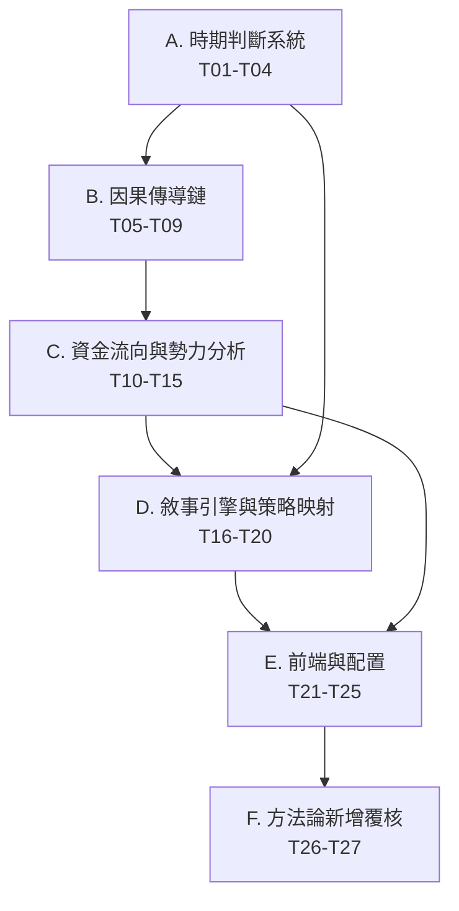

# 憲章對齊實施總表

> **版本**: v1.0
> **產出日期**: 2026-07-27
> **對應差距審計**: `docs/manifest-constitution-gap-audit.md` v1.2
> **對應方法論**: `docs/ATLAS_METHODOLOGY.md`
> **對應審計報告**: `docs/ATLAS_CONSTITUTION_AUDIT.md`

---

## 實施原則

1. **Phase 為邊界，Task 為可交付單元**：每個 Task 必須對應單一 PR 或單一 commit。
2. **下游依賴上游**：時期判斷（Phase 0）是所有後續階段的前置；Phase 5 的 DeepSeek 覆核需等所有實作穩定後再啟動。
3. **T27 交叉驗證**：所有 26 個實作任務完成後，由 T27 進行回測與憲章一致性驗證。
4. **文件同步**：任何 Task 完成時，必須同步更新 `docs/manifest-constitution-gap-audit.md` 與 `docs/ATLAS_METHODOLOGY.md` 附錄 D。

---

## 依賴圖

---

## Phase 0：A. 時期判斷系統（T01–T04）

**目標**：建立七時期判斷與向下相容映射，作為全憲章實作的基礎。

| Task | 標題 | 內容 | 狀態 | PR / Commit |
|------|------|------|------|-------------|
| T01 | 七時期判斷器 | 實作 `PeriodDetector.DetectPeriod()`，輸出 `MarketPeriod`（低迷/轉折開高/上升/高原/盤整/轉折下壓/黑天鵝） | ✅ | #1372 |
| T02 | 時期→三態映射 | 實作 `PeriodToRegime(MarketPeriod) → Regime`，確保既有三態 consumer 不受影響 | ✅ | #1372 |
| T03 | 三套 regime 統一 | 對齊 `domain.Regime`、`realtime.RegimeType`、`sim.RegimeType` 的命名空間與映射 | ✅ | #1372 |
| T04 | RiskLevel 自動推導 | 依據七時期 + 壓力指標自動推導 `macroflow.RiskLevel` | ✅ | #1372 |

**驗收**：`/api/period/current` 或等價 API 可回傳時期名稱、對應三態、RiskLevel。

---

## Phase 1：B. 因果傳導鏈（T05–T09）

**目標**：調整管線順序並建立層級依賴，使憲章第〇至七層因果鏈可追蹤。

| Task | 標題 | 內容 | 狀態 | PR / Commit |
|------|------|------|------|-------------|
| T05 | 管線順序重排 | 將 `MacroFlow` 移至推薦與權重應用之前；順序符合「由上而下、由外而內」 | ✅ | #1372 |
| T06 | 層級依賴強制 | 每層輸出 struct 成為下一層輸入，禁止反向推導；新增 layer-0..7 parent reference | ✅ | #1381 |
| T07 | MacroDataSnapshot 補漏 | 補齊 Fed 預期、半導體設備進口、集中市場成交量、當沖佔比、壽險/銀行、公司派/內部人、散戶買賣超/融資維持率/Google Trends、事件鏈接 | ✅ | #1372 |
| T08 | macro data 注入 regime | 修復 VIX key mismatch（`^VIX` vs `$VIX`），將 US10Y/DXY/SOX/TSM ADR/NVDA 等快照欄位注入 regime inference | ✅ | #1372 |
| T09 | Causal chain tracing | 每個推薦可追溯到 layer-0..7 ID、每層輸入快照、輸出結論、parent reference | ✅ | #1372 |

**驗收**：`ExecuteWithContext()` 的 trace 輸出包含 layer 0..7 的輸入/輸出/結論。

---

## Phase 2：C. 資金流向與勢力分析（T10–T15）

**目標**：補齊七大勢力數據、修復 capitalflow 權威斷點、統一散戶反向指標。

| Task | 標題 | 內容 | 狀態 | PR / Commit |
|------|------|------|------|-------------|
| T10 | 七大勢力數據源 | 新增壽險/銀行、公司派/內部人 provider/adapter/dimension；補齊散戶融資維持率/當沖佔比/券商分行/Google Trends | ✅ | #1372 |
| T11 | 公股行庫自動化 | 建立自動化分點加總通道，取代手動 JSON dump | ✅ | #1372 |
| T12 | capitalflow 進主決策鏈 | orchestrator 改讀 `capitalflow.CapitalFlowAssessment.PrimaryFlow`，消除同名異物 | ✅ | #1372 |
| T13 | 4-layer Assessment 消費者 | 將 `DominantActor`/`DominantSignal`/`Resonance` 等欄位接入 `eventdriven.Predictor` 與權重調整 | ✅ | #1378 |
| T14 | QualityScore 動態權重 | `cfScore` 從常數權重改為依據外資權威動態調整 | ✅ | #1372 |
| T15 | 散戶反向指標統一 | 將 `portfolio.factor_engine_institutional` 的散戶計算統一為 `capitalflow.ForceRetail` 口徑 | ✅ | #1372 |

**驗收**：`CapitalFlowAssessment` 被 orchestrator 與 eventdriven 實際消費，且 QualityScore 與憲章公式一致。

---

## Phase 3：D. 敘事引擎與策略映射（T16–T20）

**目標**：讓 detector 隨時期調整敏感度，並讓策略選擇自動對齊憲章策略矩陣。

| Task | 標題 | 內容 | 狀態 | PR / Commit |
|------|------|------|------|-------------|
| T16 | detector 時期敏感度 | 為 5 個關鍵 detector（US_rates_up、JPY_carry_unwind、tariff_shock、AI_capex_surge、earnings_blackout）實作 7 時期差異化權重 | ✅ | #1372 |
| T17 | 時期→策略自動選擇 | 實作 `MethodologyAdvisor` 消費 `configs/methodology_rules.yaml` | ✅ | #1372 |
| T18 | 推薦引擎按時期過濾 | `buildPremiumStrategy()` 與 `TierRegistered` 改呼叫 `GetApplicableStrategies(regime)` | ✅ | #1372 |
| T19 | Narrative 全 themes 進 regime | 將 24 個 detector themes 全部納入 `NarrativeEvidenceSource`，權重隨時期調整 | ✅ | #1372 |
| T20 | 六策略×七時期配置 | `RegimeAllocator` 擴展為 all_weather/value/growth/momentum/event_arbitrage/cash_only 六策略 | ✅ | #1372 |

**驗收**：給定任意時期，系統可輸出適用策略清單與現金部位建議，且與憲章第五節矩陣一致。

---

## Phase 4：E. 前端與配置（T21–T25）

**目標**：將時期資訊暴露到 API 與前端，並讓 tier gating 與策略類別一致。

| Task | 標題 | 內容 | 狀態 | PR / Commit |
|------|------|------|------|-------------|
| T21 | YAML config loader | 擴展 `internal/config/parameters_load.go` 支援 YAML parser/loader | ✅ | #1372 |
| T22 | 七時期閾值參數化 | 將外資買賣超金額、連續天數、融資、當沖、SOX、TSM ADR、期貨未平倉等閾值納入 `ParametersConfig` | ✅ | #1372 |
| T23 | API 時期結構化欄位 | `/api/dashboard/daily-summary` 與 `/api/reports/latest` 輸出 period id/name、觸發指標、cash reserve、allowed strategies | ✅ | PR #1388 |
| T24 | 前端七時期 UI 卡片 | 新增七時期專用元件、轉換矩陣、指標明細、策略映射 | ⬜ | — |
| T25 | 策略類別三分類 | `home-tier-sections.js` 按 defensive/aggressive/tactical 分類，並依 YAML primary/secondary 過濾 | ⬜ | — |

**驗收**：前端用戶可看到當前時期卡片、適用策略與現金部位建議；未登入 tier 僅顯示 defensive 策略。

---

## Phase 5：F. 方法論新增覆核（T26–T27）

**目標**：DeepSeek 方法論覆核與選股層策略庫設計；T27 執行全階段交叉驗證。

| Task | 標題 | 內容 | 狀態 | PR / Commit |
|------|------|------|------|-------------|
| T26 | DeepSeek 方法論覆核 | 覆核外資雙重動機、自營商大小分流、投信主被動分流、公股分點追蹤，產出設計文件 | ⬜ | — |
| T27 | 選股層策略庫 + 交叉驗證 | 設計 Phase 4 選股層策略庫；並對 T01–T26 進行歷史回測與憲章一致性驗證 | ⬜ | — |

**驗收**：
- T26：完成 F1–F4 設計文件，並決定是否納入下一輪實作。
- T27：
  1. 選定一段歷史 replay 數據（建議 2023-01 至 2026-06）。
  2. 比對 `PeriodDetector` 分類結果與憲章時期定義的吻合度。
  3. 驗證 `GetApplicableStrategies()` 在每個時期推薦的策略與憲章策略矩陣一致。
  4. 檢查 `CapitalFlowAssessment` 在關鍵轉折點是否正確識別聰明錢方向。
  5. 輸出交叉驗證報告，並決定是否調整閾值或策略權重。

---

## 進度統計
| Phase | 總計 | ✅ 完成 | ⚠️ 部分 | ⬜ 待啟動 |
|-------|------|--------|--------|----------|
| Phase 0 — 時期判斷 | 4 | 4 | 0 | 0 |
| Phase 1 — 因果傳導 | 5 | 5 | 0 | 0 |
| Phase 2 — 資金流向 | 6 | 6 | 0 | 0 |
| Phase 3 — 敘事策略 | 5 | 5 | 0 | 0 |
| Phase 4 — 前端配置 | 5 | 3 | 0 | 2 |
| Phase 5 — 方法論新增 | 2 | 0 | 0 | 2 |
| **合計** | **27** | **23** | **0** | **4** |

---

## 與差距審計對照

| 差距審計 | 實施任務 | 備註 |
|----------|---------|------|
| A1–A4 | T01–T04 | Phase 0 |
| B1–B4 | T05–T09 | B4 含原 B5 causal tracing |
| C1–C4, C6 | T10–T13, T15 | C5 對應 T14 |
| D1–D4 | T16–T19 | D5 對應 T20 |
| E3–E5 | T23–T25 | E1/E2 對應 T21/T22 |
| F1–F5 | T26–T27 | T26 含 F1–F4，T27 含 F5 + 交叉驗證 |

---

## 版本歷史

| 版本 | 日期 | 變更摘要 |
|------|------|---------|
| v1.0 | 2026-07-27 | 恢復 Phase 0–2 憲章對齊實施總表，定義 27 個 tasks、6 個 phases、T27 交叉驗證 |

---

> **最後更新**: 2026-07-27，commit `47ebdecf`
> **維護責任**: 任何修改方法論實作的 PR，必須同步更新本文件、`docs/manifest-constitution-gap-audit.md` 與 `docs/ATLAS_METHODOLOGY.md` 附錄 D。
