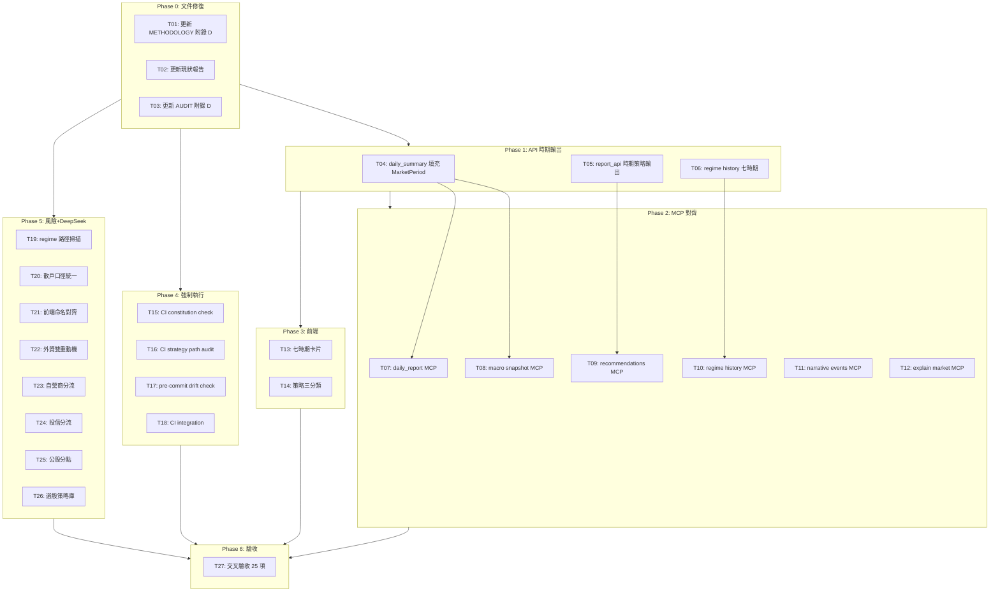

# 憲章對齊 — 實作任務清單（Implementation Manifest）

> **版本**: v1.0
> **建立日期**: 2026-07-27
> **用途**: 依賴順序編排的實作任務；最後一項強制交叉驗收問題盤查清單
> **對應問題**: `docs/manifest-constitution-gap-audit.md`
> **總計**: 6 個 phase，22 個任務

---

## Phase 0：文件體系修復（先決條件）

> 先讓文件說實話，後續工作才有可信基礎。

| # | 任務 | 對應問題 | 對象 | 驗收標準 | 估計 |
|---|------|---------|------|---------|------|
| T01 | 更新 `ATLAS_METHODOLOGY.md` 附錄 D — 將 #1372/#1378/#1381 已完成項目標 ✅ | C1 | `docs/ATLAS_METHODOLOGY.md` | 所有已完成的 P0/P1/P2 項目標 ✅，未完成項保持 ⬜ | 0.5h |
| T02 | 更新 `ATLAS_METHODOLOGY.md` §現狀報告表格 — 加入 PeriodDetector / MethodologyAdvisor / MarketPeriod | C3 | `docs/ATLAS_METHODOLOGY.md:14-27` | 表格反映七時期架構，非僅舊三態 | 0.5h |
| T03 | 更新 `ATLAS_CONSTITUTION_AUDIT.md` 附錄 D — 反映 #1378(B2/C4) / #1381 修復狀態 | C2 | `docs/ATLAS_CONSTITUTION_AUDIT.md` | B2→✅, C4→✅, commit ref 更新至 HEAD | 0.3h |

---

## Phase 1：API 時期輸出（MCP + 前端的前置依賴）

| # | 任務 | 對應問題 | 對象 | 驗收標準 | 估計 |
|---|------|---------|------|---------|------|
| T04 | 在 daily_summary builder 中調用 PeriodDetector 並填充 `MarketPeriod` 欄位 | A1 | `internal/orchestrator/` (daily_summary builder) | `GET /api/reports/latest` 回應含 `market_period` 欄位 | 1h |
| T05 | 在 `report_api.go` 加入 period→allowed_strategies + cash_reserve 輸出 | A1 | `internal/apigateway/report_api.go` | API 輸出含 `allowed_strategies`(依時期過濾) + `cash_reserve`(依時期建議) | 1h |
| T06 | `regime_get_history` API 擴展為輸出七時期歷史（非僅三態） | B3 | `internal/apigateway/` (regime history handler) | `GET /api/regime/history` 回應含 `periods[]` 陣列，每項有 period_id + detected_at + indicators | 2h |

---

## Phase 2：MCP 工具對齊（6 項）

| # | 任務 | 對應問題 | 對象 | 驗收標準 | 估計 |
|---|------|---------|------|---------|------|
| T07 | `daily_report` MCP 工具加入 `market_period` / `allowed_strategies` / `cash_reserve` 欄位 | B1 | `cmd/atlas-mcp/server/tools_report.go` | MCP `daily_report` 回應含憲章時期資訊 | 1h |
| T08 | `macro_get_snapshot_latest` MCP 工具加入當前時期 ID + 名稱 | B2 | `cmd/atlas-mcp/server/tools_macro.go` | 回應含 `period` 物件 `{id, name_zh}` | 0.5h |
| T09 | `get_recommendations` MCP 工具加入 `MethodologyAdvisor.FilterStrategies()` 時期過濾 | B4 | `cmd/atlas-mcp/server/tools_recommend.go` | RISK_OFF 時期不再推薦 growth/momentum | 1h |
| T10 | `regime_get_history` MCP 工具輸出七時期歷史（與 T06 共用後端） | B3 | `cmd/atlas-mcp/server/tools_regime.go` | MCP 回應含七時期歷史 | 1h |
| T11 | `narrative_get_events` MCP 工具加入 `period_weight` 欄位 | B5 | `cmd/atlas-mcp/server/tools_narrative.go` | 每個 detector 輸出含當時期敏感度權重 | 1h |
| T12 | `explain_market_move` MCP 工具加入憲章因果鏈標註（layer-0...layer-7） | B6 | `cmd/atlas-mcp/server/tools_market.go` | 回應含 `causal_chain` 陣列，每層有 layer_id + conclusion | 1.5h |

---

## Phase 3：前端對齊（2 項）

| # | 任務 | 對應問題 | 對象 | 驗收標準 | 估計 |
|---|------|---------|------|---------|------|
| T13 | 實作「當前市場時期卡片」UI 元件 — 七時期名稱 + 觸發指標 + 現金建議 + 允許策略 | A2 | `frontend/src/` | 前端可見七時期卡片，含憲章定義的所有資訊 | 3h |
| T14 | 實作策略類別三分類 — defensive/aggressive/tactical 替換 free/registered/premium gating | A3 | `frontend/src/` | `home-tier-sections.js` 按憲章三分類做內容過濾 | 2h |

---

## Phase 4：憲章強制執行機制（4 項）

| # | 任務 | 對應問題 | 對象 | 驗收標準 | 估計 |
|---|------|---------|------|---------|------|
| T15 | CI: 加入 `make ci-constitution` target — 驗證 `methodology_rules.yaml` ↔ `MethodologyAdvisor` 策略矩陣一致 | D1, D2 | `Makefile` + `scripts/check-constitution.sh` | `make ci-full` 失敗若 YAML 與程式碼策略映射不一致 | 2h |
| T16 | CI: 加入策略路徑稽核 — 掃描所有 `buildPremiumStrategy`/`GetRecommendations` 呼叫點，確保經過 `MethodologyAdvisor.FilterStrategies` | D1, D3 | `scripts/check-strategy-path.sh` | 任何繞過 MethodologyAdvisor 的推薦路徑 → CI 失敗 | 1.5h |
| T17 | pre-commit: 檢查新增 domain struct 欄位是否在憲章文件中有對應描述 | D4 | `scripts/check-constitution-drift.sh` + `.githooks/` | 新欄位無憲章對應 → commit 被阻擋並提示 | 1.5h |
| T18 | CI: `make ci-constitution` 整合進 `make ci-full` | D1 | `Makefile` | `make ci-full` 包含憲章驗證 | 0.5h |

---

## Phase 5：隱性風險 + DeepSeek（8 項）

| # | 任務 | 對應問題 | 對象 | 驗收標準 | 估計 |
|---|------|---------|------|---------|------|
| T19 | 掃描全部 production code path，確保 `PeriodToRegime()` 在所有需要 regime 判斷的入口被調用 | E1 | `internal/` | grep 確認無直接 hardcode 三態而繞過 PeriodDetector 的路徑 | 1h |
| T20 | 統一套利計算口徑：`portfolio.factor_engine_institutional` 改用 `capitalflow.ForceRetail` | E3 | `internal/portfolio/` | 僅一套散戶反向指標來源 | 1.5h |
| T21 | 前端策略類別命名改為憲章三分類 | E2 | `frontend/src/` | 無遺留 free/registered/premium 命名（或建立 mapping） | 1h |
| T22 | 外資雙重動機模型：`MacroDataSnapshot` 加入 structural_vs_speculative 標記欄位 | F1 | `internal/domain/types.go` + `internal/marketdata/` | 外資流向可區分結構性 vs 投機性 | 3h |
| T23 | 自營商大小分流：大型自營商行為納入 macro evidence | F2 | `internal/portfolio/` + `internal/marketdata/` | 大型自營商操作可作為 macro 信號來源 | 2h |
| T24 | 投信主動 vs 被動分流：ETF 規模變化與主動基金操作分開追蹤 | F3 | `internal/marketdata/` | 投信維度可區分被動（ETF）與主動（基金經理人判斷） | 2h |
| T25 | 公股分點追蹤：自建證交所分點加總作為 BK-13 替代方案 | F4 | `internal/marketdata/` | 公股行庫操作有自動化數據來源 | 5h |
| T26 | 選股層策略庫設計（Phase 4 規劃文件） | F5 | `docs/` | 選股層策略庫設計文件，含憲章對齊 | 2h |

---

## Phase 6：交叉驗收（強制）

| # | 任務 | 對應問題 | 對象 | 驗收標準 | 估計 |
|---|------|---------|------|---------|------|
| **T27** | **交叉驗收：逐項檢查 `manifest-constitution-gap-audit.md` 全部 25 項，確認每項有對應實作且通過驗收標準** | 全部 | `docs/manifest-constitution-gap-audit.md` | 25 項全部打 ✅；若有未覆蓋項 → 退回對應 Phase 補做 | 2h |

> **T27 為強制最後一步** — 任何未通過的項目必須回溯修復，不可跳過。

---

## 依賴關係圖

---

## 估計總工時

| Phase | 項目數 | 估計 |
|-------|--------|------|
| Phase 0: 文件修復 | 3 | 1.3h |
| Phase 1: API | 3 | 4h |
| Phase 2: MCP | 6 | 6h |
| Phase 3: 前端 | 2 | 5h |
| Phase 4: 強制執行 | 4 | 5.5h |
| Phase 5: 風險+DeepSeek | 8 | 17.5h |
| Phase 6: 驗收 | 1 | 2h |
| **合計** | **27** | **~41h** |

---

> **執行規則**:
> - Phase 內任務可平行（無相依關係）
> - Phase 間必須依序（Phase N 完成後才能進入 Phase N+1）
> - T27 為強制最終步驟，未通過則退回修復
> - 每個任務完成後，在 `manifest-constitution-gap-audit.md` 對應項目打 ✅
